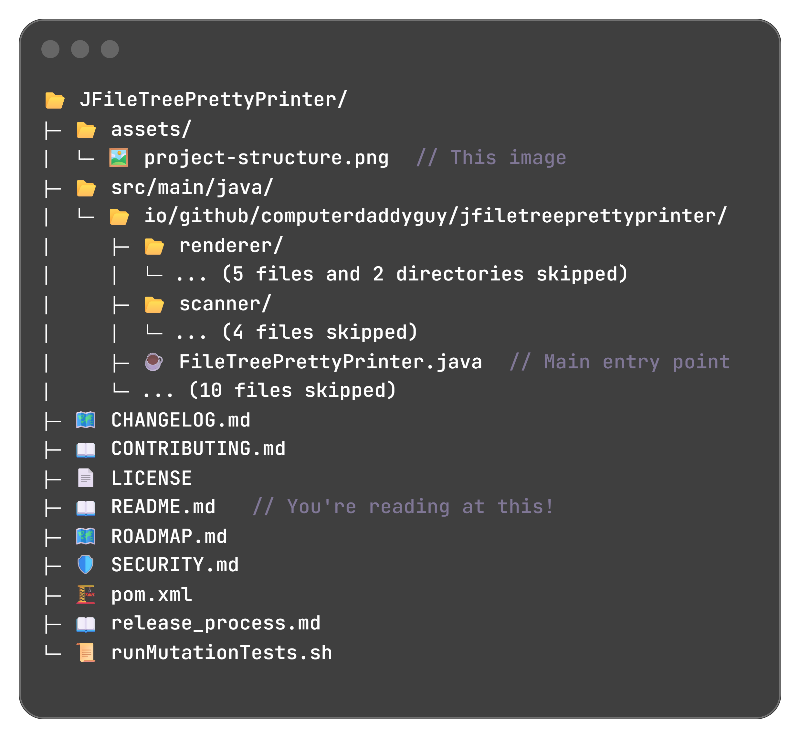

# JFileTreePrettyPrinter
[](https://sonarcloud.io/summary/new_code?id=ComputerDaddyGuy_JFileTreePrettyPrinter)
[](https://sonarcloud.io/summary/new_code?id=ComputerDaddyGuy_JFileTreePrettyPrinter)
[](https://sonarcloud.io/summary/new_code?id=ComputerDaddyGuy_JFileTreePrettyPrinter)
[](https://sonarcloud.io/summary/new_code?id=ComputerDaddyGuy_JFileTreePrettyPrinter)

[](https://maven-badges.herokuapp.com/maven-central/io.github.computerdaddyguy/jfiletreeprettyprinter/)
[](https://javadoc.io/doc/io.github.computerdaddyguy/jfiletreeprettyprinter)
[](https://github.com/computerdaddyguy/jfiletreeprettyprinter/blob/main/LICENSE)

**A lightweight and flexible Java library with a native CLI to pretty-print directory structures - ideal for documentation, project overviews, or CLI tools.** 

Supports various [options](#customization-options) to customize the directories scanning and rendering:
- Filtering & sorting files and folders
- Emojis as file icons 🎉
- Limit displayed children of a folder (fixed value or dynamically)
- Custom line extension (comment, file details, etc.)
- Compact directory chains
- Maximum scanning depth
- Various styles for tree rendering

> [!NOTE]
> JFileTreePrettyPrinter is perfect to explain your project structure!  
> See <a href="jfiletreeprettyprinter-examples/src/main/java/io/github/computerdaddyguy/jfiletreeprettyprinter/example/ProjectStructure.java">ProjectStructure.java</a> to read the code that generated the tree from the below picture.

<p align="center">
	
</p>

* [Why use JFileTreePrettyPrinter?](#why-use-jfiletreeprettyprinter)
* [Java lib](#java-lib)
  * [Requirements](#requirements)
  * [Import dependency](#import-dependency)
  * [Basic usage](#basic-usage)  
  * [Customization options](#customization-options)
* [Native CLI](#native-cli)
  * [Download and install](#download-and-install)
  * [Usage](#cli-usage)
  * [Options](#cli-options)  
* [Project Information](#project-information) 

# Why use JFileTreePrettyPrinter?
Unlike a plain recursive `Files.walk()`, this library:
- Prints **visually appealing** directory trees.
- Allows **rich customization** (filters, sorts, emojis, compacting, tree style).
- Supports **dynamic child limits** and **custom extensions** per line.
- Is **dependency-free** (on runtime) and compatible with **Java 21+**.

# Java lib

## Requirements
- **Java 21 or later**
- No runtime dependencies!

## Import dependency
For Maven, import this dependency to your `pom.xml`:

```xml
<dependency>
  <groupId>io.github.computerdaddyguy</groupId>
  <artifactId>jfiletreeprettyprinter-core</artifactId>
  <version>0.1.1</version>
</dependency>
```

For Gradle:
```groovy
implementation "io.github.computerdaddyguy:jfiletreeprettyprinter-core:0.1.1"
```

## Basic usage
```java
// Example: BasicUsage.java
var printer = FileTreePrettyPrinter.createDefault(); // Create a printer with default options
var tree = printer.prettyPrint("src/example/resources/base"); // Pretty print the target folder
System.out.println(tree); // Admire the result!
```

Result:

```text
base/
├─ businessPlan.pdf
├─ businessProject.pdf
├─ cars/
│  ├─ Ferrari.doc
│  └─ Porsche.doc
├─ diyIdeas.docx
├─ giftIdeas.txt
└─ images/
   ├─ funnyCat.gif
   ├─ holidays/
   │  ├─ meAtTheBeach.jpeg
   │  └─ meAtTheZoo.jpeg
   └─ landscape.jpeg
```

> [!NOTE]
> In case of error while reading directories or files, an [UncheckedIOException](https://docs.oracle.com/en/java/javase/21/docs/api/java.base/java/io/UncheckedIOException.html) is thrown. 

## Customization options
> [!NOTE]
> All code below is availabe in [jfiletreeprettyprinter-examples] submodule.(jfiletreeprettyprinter-examples\src\main\java\io\github\computerdaddyguy\jfiletreeprettyprinter\example)

* [Filtering](#filtering)
* [Sorting](#sorting)
* [Emojis ❤️](#emojis-%EF%B8%8F)
* [Child limit](#child-limit)
* [Line extension](#line-extension)
* [Compact directories](#compact-directories)
* [Max depth](#max-depth)
* [Tree format](#tree-format)
  
### Filtering
Files and directories can be selectively included or excluded using a custom `PathMatcher`.

Filtering applies independently to files and directories. Files are filtered only if their parent directory passes the directory filter.
If none of a directory’s children match, the directory is still displayed.

The `PathMatchers` class provides several ready-to-use methods for creating and combining common matchers.

```java
// Example: Filtering.java
var excludeDirWithNoJavaFiles = PathMatchers.not(PathMatchers.hasNameEndingWith("no_java_file"));
var hasJavaExtension = PathMatchers.hasExtension("java");

var prettyPrinter = FileTreePrettyPrinter.builder()
	.customizeOptions(
		options -> options
			.filterDirectories(excludeDirWithNoJavaFiles)
			.filterFiles(hasJavaExtension)
	)
	.build();
```

```text
filtering/
├─ dir_with_java_files/
│  ├─ file_B.java
│  └─ file_E.java
├─ dir_with_nested_java_files/
│  └─ nested_dir_with_java_files/
│     ├─ file_G.java
│     └─ file_J.java
└─ file_A.java
```

### Sorting
Files and directories can be sorted using a custom comparator (default is alphabetical order).
If the provided comparator considers two paths equal (i.e., returns `0`), an alphabetical comparator is applied as a tie-breaker to ensure consistent results across all systems.  

The `PathSorts` class provides a set of basic, ready-to-use comparators, as well as a builder for creating your own tailor-made sort.

```java
// Example: Sorting.java
var prettyPrinter = FileTreePrettyPrinter.builder()
    .customizeOptions(options -> options.sort(PathSorts.DIRECTORY_FIRST))
    .build();
```

```text
sorting/
├─ c_dir/
│  └─ c_file
├─ d_dir/
│  ├─ d_b_dir/
│  │  └─ d_b_file
│  └─ d_a_file
├─ a_file
├─ b_file
├─ x_file
└─ y_file
```

### Emojis ❤️
You can choose to use default built-in emojis, or define your own emoji mapping.
Folders use the 📂 emoji, and files will have an emoji depending on their name or extension (when applicable).  
Define your own emoji mappings with the `EmojiMapping` class!

```java
// Example: Emojis.java
var prettyPrinter = FileTreePrettyPrinter.builder()
    .customizeOptions(options -> options.withDefaultEmojis()) // or withEmojis(EmojiMapping) for custom mapping
    .build();
```

```text
// Run Emojis.java example for the full list of emoji mappings
📂 emojis/
├─ 📦 file.zip
├─ 🐳 Dockerfile
├─ 🤵 Jenkinsfile
├─ ☕ file.java
├─ 📖 readme
├─ ⚙️ file.ini
├─ 📊 file.xlsx
├─ 📃 file.docx
├─ 📕 file.pdf
├─ 🎵 file.mp3
├─ 🖼️ file.jpeg
└─ 🎬 file.avi
```

### Child limit
You can set a fixed limit to the number of children displayed for each directory. Each directory and file that pass the filter (if set) counts for one.

```java
// Example: ChildLimitStatic.java
var prettyPrinter = FileTreePrettyPrinter.builder()
    .customizeOptions(options -> options.withChildLimit(3))
    .build();
```

```text
child_limit_static/
├─ file_0_1
├─ folder_1/
│  ├─ file_1_1
│  ├─ file_1_2
│  ├─ file_1_3
│  └─ ...
├─ folder_2/
│  ├─ file_2_1
│  ├─ file_2_2
│  ├─ file_2_3
│  └─ ...
└─ ...

```

Or you can also set a limitation function, to dynamically choose the number of children displayed in each directory.
This avoids cluttering the result with known large folders (e.g. `node_modules`) while continuing to pretty-print other folders normally.

Use the `ChildLimits` class to help you build the limit function that fits your needs.

```java
// Example: ChildLimitDynamic.java
var childLimit = ChildLimits.builder()
	.setDefault(ChildLimits.UNLIMITED)            // Unlimited children by default
	.add(PathMatchers.hasName("node_modules"), 0) // Do NOT print any children in "node_modules" folder
	.build();
var prettyPrinter = FileTreePrettyPrinter.builder()
	.customizeOptions(options -> options.withChildLimit(childLimit))
	.build();
```

```text
child_limit_dynamic/
├─ file_0_1
├─ folder_1/
│  ├─ file_1_1
│  ├─ file_1_2
│  ├─ file_1_3
│  ├─ file_1_4
│  └─ file_1_5
└─ node_modules/
   └─ ...
```

### Line extension
You can extend each displayed path with additional information by providing a custom `Function<Path, String>`.
This is useful to annotate your tree with comments, display file sizes, or add domain-specific notes.

The function receives the current path and returns an optional string to append (empty string is authorized).
If the function returns `null`, nothing is added.

Use the `LineExtensions` class to help you build line extension functions.

```java
// Example: LineExtension.java
var printedPath = Path.of("src/example/resources/line_extension");

Function<Path, String> lineExtension = LineExtensions.builder()
	.add(PathMatchers.hasRelativePathMatchingGlob(printedPath, "src/main/java/api"), "\t\t\t// All API code: controllers, etc.")
	.add(PathMatchers.hasRelativePathMatchingGlob(printedPath, "src/main/java/domain"), "\t\t\t// All domain code: value objects, etc.")
	.add(PathMatchers.hasRelativePathMatchingGlob(printedPath, "src/main/java/infra"), "\t\t\t// All infra code: database, email service, etc.")
	.add(PathMatchers.hasNameMatchingGlob("*.properties"), "\t// Config file")
	.build();
	
var prettyPrinter = FileTreePrettyPrinter.builder()
	.customizeOptions(options -> options.withLineExtension(lineExtension))
	.build();
```

```text
line_extension/
└─ src/
   └─ main/
      ├─ java/
      │  ├─ api/			// All API code: controllers, etc.
      │  │  └─ Controller.java
      │  ├─ domain/			// All domain code: value objects, etc.
      │  │  └─ ValueObject.java
      │  └─ infra/			// All infra code: database, email service, etc.
      │     └─ Repository.java
      └─ resources/
         └─ application.properties	// Config file
```

### Compact directories
Directory chains with a single child directory are fully expanded by default, but you can inline them into a single tree entry.

```java
// Example: CompactDirectories.java
var prettyPrinter = FileTreePrettyPrinter.builder()
    .customizeOptions(options -> options.withCompactDirectories(true))
    .build();
```

```text
single_directory_child/
├─ file1
├─ file2
└─ this/is/single/directory/child/
   ├─ file1
   ├─ file2
   └─ file3
```

### Max depth
You can customize the default max depth (default is 20).

```java
// Example: MaxDepth.java
var prettyPrinter = FileTreePrettyPrinter.builder()
    .customizeOptions(options -> options.withMaxDepth(3))
    .build();
```

```text
max_depth/
└─ level1/
   ├─ file1#1
   ├─ file1#2
   └─ level2/
      ├─ file2#1
      ├─ file2#2
      └─ level3/
         └─ ... (max depth reached)
```

### Tree format
Choose between different built-in tree formats, or create your own.
The default is `UNICODE_BOX_DRAWING`, supported by all terminals, but you can also switch to use `CLASSIC_ASCII`.

```java
// Example: FileTreeFormat.java
var prettyPrinter = FileTreePrettyPrinter.builder()
    .customizeOptions(options -> options.withTreeFormat(TreeFormats.CLASSIC_ASCII))
    .build();
```

```text
tree_format/
|-- file_1
|-- file_2
`-- subFolder/
    |-- subFile_1
    `-- subFile_2
```
# Native CLI

## Download and install
You can download the latest CLI release directly from https://github.com/ComputerDaddyGuy/JFileTreePrettyPrinter/releases/latest.  
Choose the archive for your platform (Windows, Linux, or macOS), download it, and unzip it anywhere on your system.

> [!NOTE]
> If desired, add the executable’s folder to your system’s `PATH` variable to run it from any directory.

## CLI usage
To pretty-print a folder and its contents, simply run:
```bash
$ jfiletreeprettyprinter <folderName>
```
Example:
```bash
$ jfiletreeprettyprinter jfiletreeprettyprinter-examples/src/main/resources/base/
base/
├─ businessPlan.pdf
├─ businessProject.pdf
├─ cars/
│  ├─ Ferrari.doc
│  └─ Porsche.doc
├─ diyIdeas.docx
├─ giftIdeas.txt
└─ images/
   ├─ funnyCat.gif
   ├─ holidays/
   │  ├─ meAtTheBeach.jpeg
   │  └─ meAtTheZoo.jpeg
   └─ landscape.jpeg
```

To get an overview of the CLI’s capabilities and available options:
```bash
$ jfiletreeprettyprinter --help
Usage: prettyprint [-dhV] [-o] [<target>]
Pretty-prints directory structure
      [<target>]   The path to pretty print
  -d, --debug      debug mode
  -h, --help       Show this help message and exit.
  -o, --options    the options file
  -V, --version    Print version information and exit.
```

### UTF-8 console
If the tree symbols appear as garbled characters (e.g., Ôöé instead of ├─), your console is likely not using UTF-8 encoding.

**Set UTF-8 Encoding**
```
# Windows
> chcp 65001

# Linux (bash, zsh)
$ export LANG=en_US.UTF-8

# macOS (bash, zsh)
$ export LC_CTYPE=UTF-8
```

## CLI options
The native CLI supports (almost all) pretty print options through an external JSON or YAML configuration file provided as an argument.
 
This configuration file must comply with the [CLI options file schema](jfiletreeprettyprinter-cli/src/main/resources/schemas/jfiletreeprettyprinter-options.schema.json).
```bash
$ jfiletreeprettyprinter myFolder --options myOptions.json
```

See an [example file](jfiletreeprettyprinter-examples/src/main/resources/cli/options/full-options.yaml).

### Options lookup order
If no options file is explicitly provided as argument, the CLI automatically searches for one in the following order:
1. **Inside the target path:**  
A `.prettyprint` file located within the directory being printed.
1. **Beside the executable:**  
A `.prettyprint` file in the same folder as the native executable.
1. **In the user’s home directory:**  
A `.prettyprint` file located in the user’s home folder.
1. **Fallback:**  
If no configuration file is found, default options are used —
equivalent to `PrettyPrintOptions.createDefault()`.

> [!TIP]
> Using a `.prettyprint` file allows each project or directory to define its own display style — no need to pass extra parameters each time.

# Project Information

* See [🆕CHANGELOG.md](CHANGELOG.md) for a list of released versions and detailed changes.
* See [🗺️ROADMAP.md](ROADMAP.md) to discover planned features and upcoming improvements.
* This project is licensed under the Apache License 2.0. See [⚖️LICENSE](LICENSE) for details.
* For any questions or feedback please open an issue on this repository, as detailed in [🤝CONTRIBUTING.md](CONTRIBUTING.md).
	
---
Made with ❤️ by [ComputerDaddyGuy](https://github.com/ComputerDaddyGuy)
